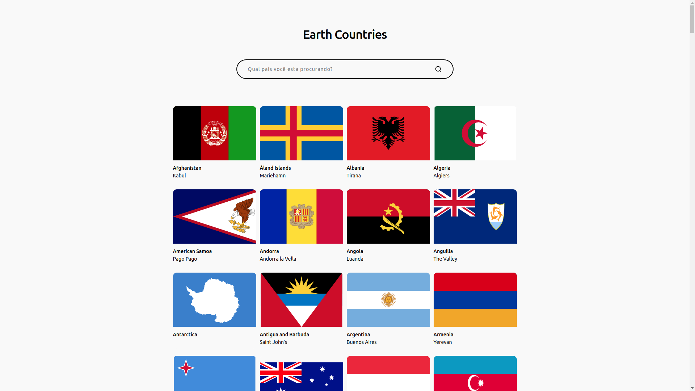

<h1 align="center">
  Earth Countries
</h1>

## Demo

<div align="center">
  
</div>

> [Staging App](https://earth-countries-staging.herokuapp.com/)
>
> [Production App](https://earth-countries-production.herokuapp.com/)

## Getting Started

### Requirements

- Node.js
- Yarn

#### Run installation & tests

> Installs the project dependencies and runs the tests.

```
yarn
yarn test
```

#### Run installation & development mode

> Installs the project dependencies and runs the application in development mode.

```
yarn
yarn start
```

#### Build application

> Installs the project dependencies. Build the React production application.

```
yarn
yarn build
```

## Project Design

### Dependencies

- <b>TypeScript</b>.
- <b>Jest</b>.
- <b>ESLint, Prettier, Stylelint</b> - It significantly increases the quality and readability of the code.
- <b>Commitlint</b> - Conventional Commits.
- <b>Husky, Lint-Staged</b> - Increases the quality of commits by running the test, ESLint and Prettier.
- <b>GraphQL</b>.

### Patterns

- <b>TDD</b>.
- <b>Single Responsibility</b>.
- <b>Dependency Injection</b> - Mainly to make the components more testable.
